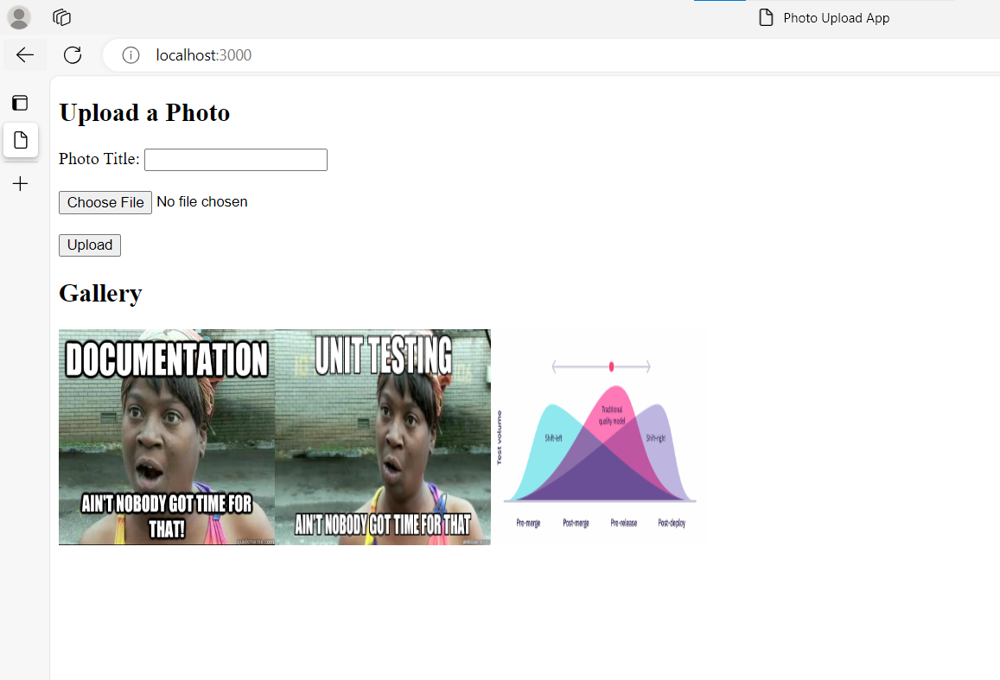
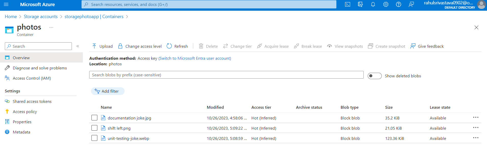
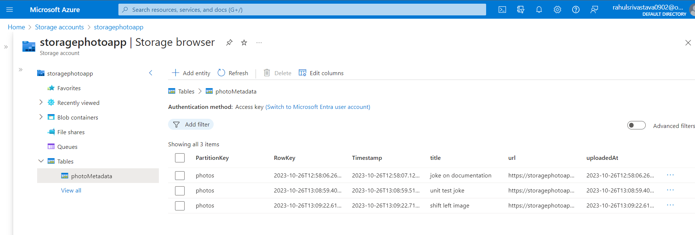

# Azure Photo App

A comprehensive web application demonstrating the integration of Azure services, such as Azure Blob Storage for image storage and Azure Table Storage for metadata.



## 🌟 Features

- 📌 **Image Upload**: Users can upload images to Azure Blob Storage.
- 🖼️ **Gallery View**: Showcases all uploaded images in a gallery format.
- 🏷️ **Metadata Storage**: Image metadata is stored in Azure Table Storage.
  
(Add more features as needed)

## 🚀 Getting Started

### Prerequisites

- An Azure account with appropriate permissions.
- [Node.js](https://nodejs.org/) installed.
- Azure Storage Account (Blob and Table Storage).

### Installation & Setup

1. **Clone the Repository**:
   ```bash
   git clone https://github.com/YOUR_GITHUB_USERNAME/azure-photo-app.git
   cd azure-photo-app
2. **Install Dependencies**:
    ```bash
    npm install
3. **Configure Environment**:
    - Rename .env.example to .env.
    - Update with Azure Blob Storage and Azure Table Storage connection strings.
4. **Run the Application**:
    ```bash
    npm start
    ```
    Navigate to http://localhost:YOUR_PORT to access the application.

## 📚 Learning & Resources

- [Azure Blob Storage Documentation](https://docs.microsoft.com/en-us/azure/storage/blobs/)
- [Azure Table Storage Documentation](https://docs.microsoft.com/en-us/azure/storage/tables/)


## Azure Photo App - Storage Choices

In the Azure Photo App project, we've utilized Azure Blob Storage and Azure Table Storage. Here's a tabular breakdown highlighting the reasons for these choices:

| Feature/Need                 | Azure Blob Storage                                                                                                                                                           | Azure Table Storage                                                                                                      |
|------------------------------|------------------------------------------------------------------------------------------------------------------------------------------------------------------------------|--------------------------------------------------------------------------------------------------------------------------|
| **Nature of Data**           | Ideal for storing unstructured data like images, videos, logs, and backups. It provides efficient storage and retrieval for the photos in the app.                              | NoSQL datastore perfect for semi-structured data. Stores related metadata (upload date, tags, captions, blob URL).        |
| **Cost-Effectiveness**       | Part of Azure's storage account services, known for cost-effective solutions. Pay only for what you use without upfront costs.                                                 | Cost-effective solution for storing large amounts of metadata without incurring high costs.                               |
| **Scalability**              | Can handle massive amounts of unstructured data, offering scalability for apps expecting growth in user-generated content.                                                     | As a NoSQL store, it scales to handle vast amounts of fast-changing data, accommodating potential growth of metadata.      |
| **Development Experience**   | Azure provides SDKs for various languages, streamlining the integration and development process, especially for Node.js apps.                                                  | Offers a simple authentication mechanism and can be easily queried, ensuring a smooth development experience.              |
| **Security & Accessibility** | Supports features like shared access signatures, granting secure and time-limited URLs for accessing blobs.                                                                    | Simple and secure authentication mechanism that ensures metadata safety.                                                  |
| **Geographical Availability**| Has a global presence allowing choice of data center locations based on the user base, ensuring quick data retrieval and adherence to data residency regulations.               | Global presence, ensuring that metadata can be stored and accessed efficiently from various geographic locations.          |

## Summary

The combination of Azure Blob Storage and Azure Table Storage offers an optimal solution for the Azure Photo App, enabling efficient storage, retrieval, and management of images and their associated metadata.

# Azure Portal Screenshots

## Screenshot of the blob stoarge after the photo has been uploaded


## Screenshot of the table stoarge after the metadata has been added



## ✨ Contributing

Feel free to open issues or provide pull requests. For major changes, kindly open an issue first to discuss what you'd like to change.

## 📜 License

This project is under the MIT License. See [LICENSE](LICENSE) file for more details.